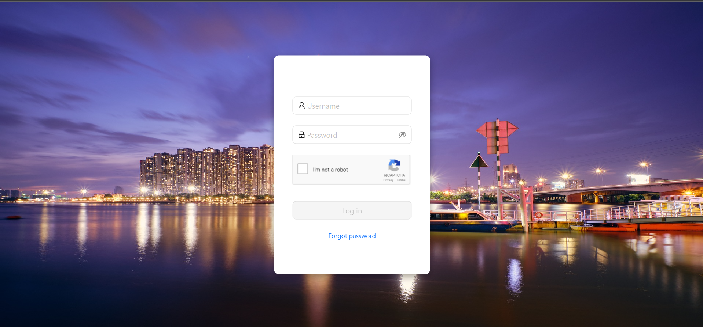
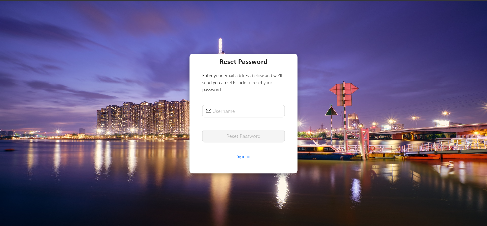
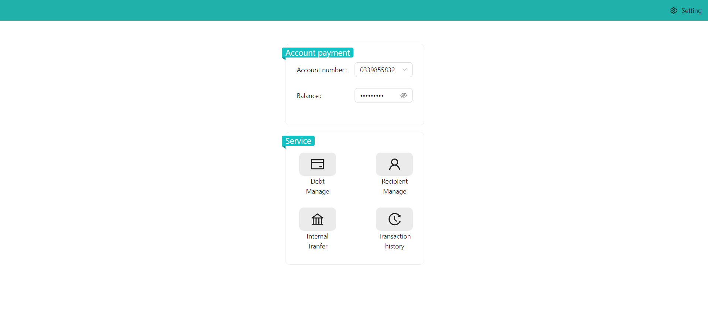
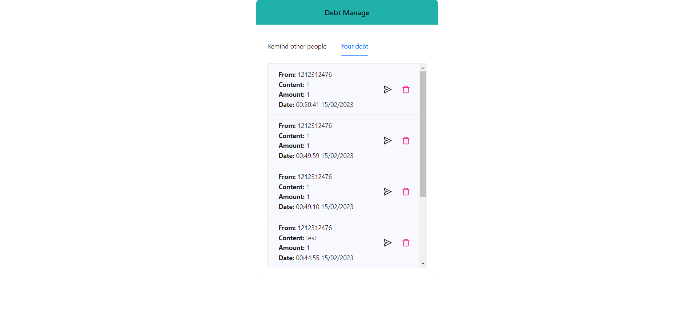
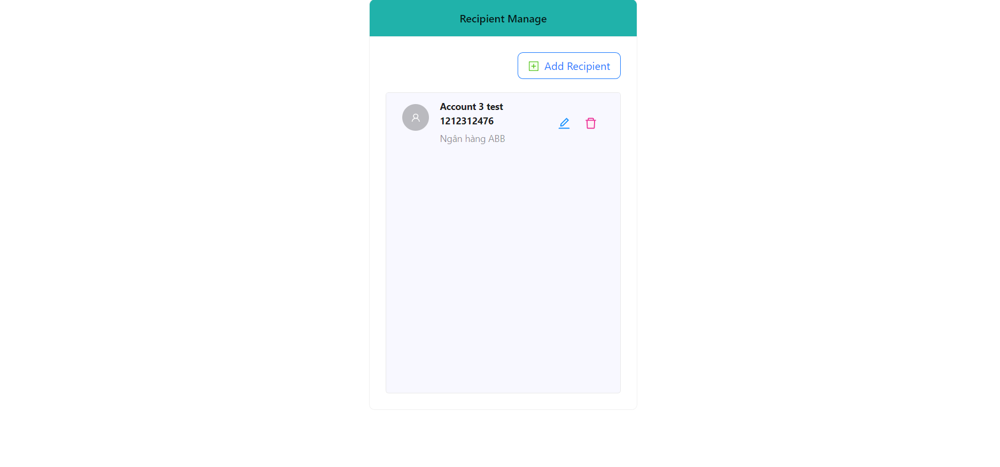
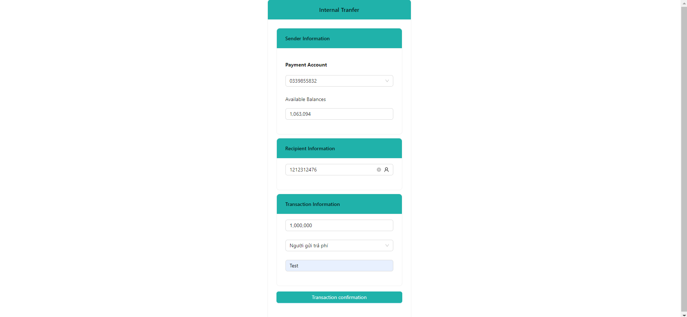
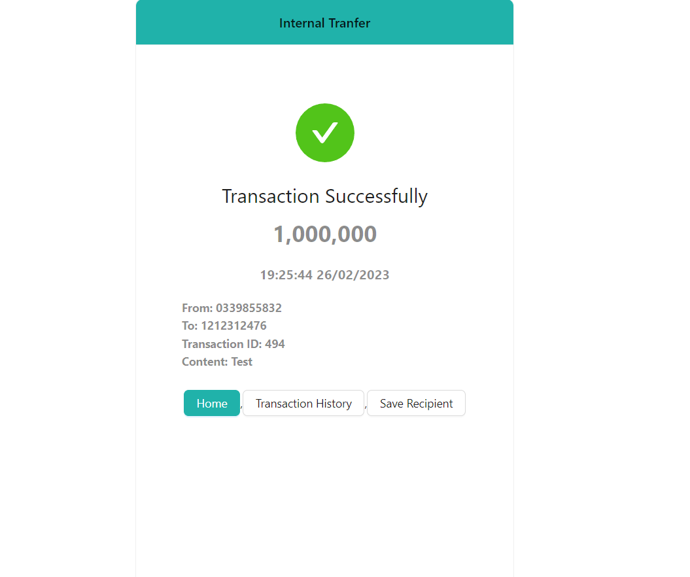
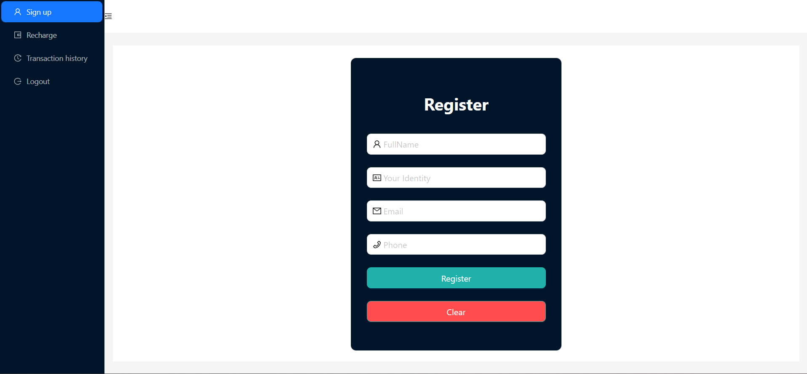
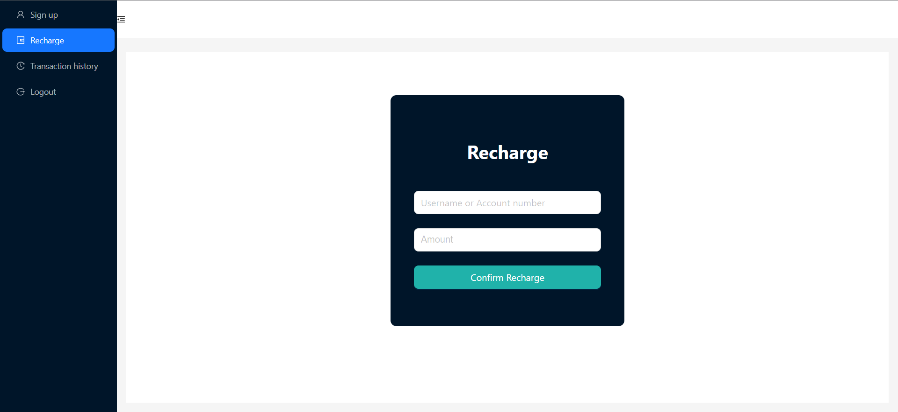
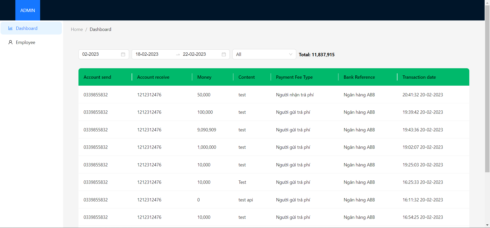

# Internet Banking Website Project
#### Link: https://node-js-internet-banking.vercel.app
# Using: Back End : - NodeJS Type Module(ES6+), Express, SocketIO, AJV Validate, Access/ Refresh Token JWT, ORM Knex
         Font End : - ReactJS , Ant Design

1. Users
- Forget password (Email verification)
- Login

2. Customer
- Debt Manage(Create, Cancel, Debt Payment) Notify Realtime SocketIO
- Recipient Manage(CRUD)
- View transaction history
- Internal transfer otp authentication sent by email
- Change password

3. Employee
- Register account for customer
- Recharge
- View transaction by any account number

4. Admin
- View/Filter transaction by month/year/bank
- Employee manage(CRUD)

# Screenshots

